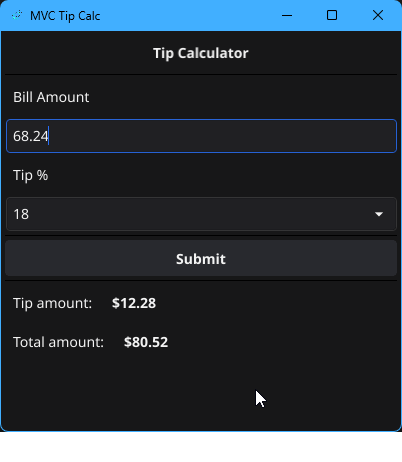

# MVC Tip Calculator
Simple Model View Controller Fyne project that doubles as a tip calculator.

The purpose of this is for me to learn MVC architecture, as well as using this as a template repo.

> Also see: https://github.com/ssebs/tipr and https://github.com/ssebs/tipr-mobile for more tip calculators.

## Screenshot of the UI

## Building and running
### Prereqs
- Install [Golang](https://go.dev/doc/install)
- Follow the install docs at https://docs.fyne.io/started/
  - This takes a while but is required to get this working.
- If running on linux
  - Add yourself to the `dialout` group
    - `sudo usermod -aG dialout <username>`

### Get the code
- From source:
  - Git clone https://github.com/ssebs/MVCTipCalc
- Go pkg
  - `go get github.com/ssebs/MVCTipCalc`

### Build the code
> The first build will take > 5 mins since fyne needs to be compiled with c, then it's cached.

- `go run main.go` 
- To package:
  - Make sure `fyne` CLI is installed
    - `go install fyne.io/fyne/v2/cmd/fyne@latest`
    - `go install github.com/fyne-io/fyne-cross@latest` for cross platform pkging
  - Windows:
    - `PS > fyne package -os windows`
      - Linux pkg for Win:
        - `fyne-cross windows`
  - Mac:
    - `$ fyne package -os darwin`
  - Linux:
    - `$ fyne package -os linux`
- Updates:
  - Make code changes 
  - Run upgrades: `go get -u && go mod tidy`
  - Update Version in `FyneApp.toml`
  - Create Pull Request
  - Once committed, git tag & push with same version from `FyneApp.toml`
  - `go install github.com/ssebs/MVCTipCalc@<version>`

## LICENSE
[Apache 2 License](./LICENSE)
